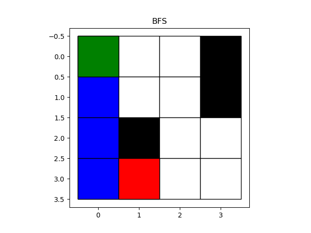
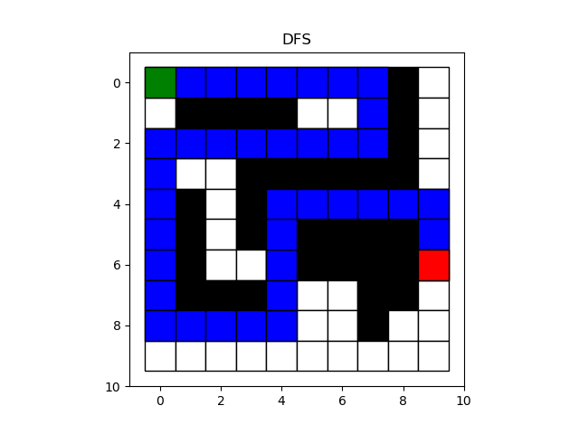

**HW 1: Breadth-First Search and Depth-First Search Implementation**

**Table of Contents**
<!-- TOC -->

- [Introduction](#introduction)
- [Depth-First Search DFS](#depth-first-search-dfs)
    - [Pseudocode: Iterative Version](#pseudocode-iterative-version)
    - [Pseudocode: Recursive Version](#pseudocode-recursive-version)
- [Breadth-First Search BFS](#breadth-first-search-bfs)
    - [Pseudocode](#pseudocode)
- [Results](#results)
    - [Breadth-First Search](#breadth-first-search)
    - [Depth-First Search](#depth-first-search)
- [Resources](#resources)

<!-- /TOC -->

# Introduction

# Depth-First Search (DFS)

## Pseudocode: Iterative Version

```python
DFS-iterative (G, s): # Where G is graph and s is source vertex
    let S be stack
    S.push( s ) # Inserting s in stack 
    mark s as visited.
    
    while ( S is not empty):
        v  =  S.top( ) # Pop a vertex from stack to visit next
        S.pop( )
        for all neighbours w of v in Graph G: # Push all the neighbours of v in stack that are not visited   
            if w is not visited :
                    S.push( w )         
                    mark w as visited
```

## Pseudocode: Recursive Version

```python
DFS-recursive(G, s):
    mark s as visited
    for all neighbours w of s in Graph G:
        if w is not visited:
            DFS-recursive(G, w)
```

# Breadth-First Search (BFS)

## Pseudocode

```python
BFS (G, s) # Where G is the graph and s is the source node
    let Q be queue.
    Q.enqueue( s ) # Inserting s in queue until all its neighbour vertices are marked.
    mark s as visited.

        while ( Q is not empty)
            v  =  Q.dequeue( )# Removing that vertex from queue,whose neighbour will be visited now

            for all neighbours w of v in Graph G # processing all the neighbours of v  
                if w is not visited 
                    Q.enqueue( w ) # Stores w in Q to further visit its neighbour
                    mark w as visited.
```

# Results

## Breadth-First Search



## Depth-First Search



# Resources

- [HackerEarth: Depth First Search](https://www.hackerearth.com/practice/algorithms/graphs/depth-first-search/tutorial/)
- [HackerEarth: Breadth First Search](https://www.hackerearth.com/practice/algorithms/graphs/breadth-first-search/tutorial/)